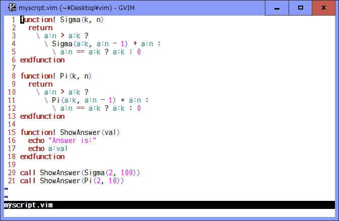

# partialnumber.vim

## Yet another line number option

### Introduction

This plugin shows the line number partially for a specified range with an
optional highlight group in the sign column.

While running some plugin or your vimrc, you might have seen such an error
message:
```
  Error detected while processing function MyFunc1:
  line   37:
  E727: Start past end

  Error detected while processing function MyFunc2:
  line   61:
  E684: list index out of range: 19
```
Even if the `number` and `relativenumber` options are used in a window, it is
not easy to identify where those errors have happened in the functions.

In addition, when debugging your vim script, you can specify the line number
for a function as a breakpoint in the `:breakadd` and `:breakdel` commands and
also can see the hierarchy of the function call including the line number in
the `:backtrace` command. But those line numbers are relative to the start of
the function.

By using this plugin, for example,
```
  :g/^\s*\<fu\%[nction]\>/+1,/^\s*\<endf\%[unction]\>/-1 SetPNU
```
will assign and show the line numbers for each function individually so that
you can see those relative line numbers in the sign column.

The highlight group (default: `hl-SignColumn`) can be used to differently show
the partial line numbers with its highlight.

Since the vim's sign feature allows to use only 2 columns, a line number is
separated into the ones place digit and upper ones. In each 10th line, the
upper 2 digits are displayed. In other lines, the last 1 digit is displayed in
right half of the column. For example, the 370th, 371th, and 372th lines are
displayed as "37", " 1", and " 2". If the `ambiwidth` option is set to
"double", the upper digits are displayed with those circled numbers.

To save the column space, it is useful to set `signcolumn` option to "number"
and puts them in the number column, if possible.

When some lines are added or deleted while showing the partial line numbers,
this plugin will try to follow those changes and update the line numbers.

### Command

* `:[range]SetPNU [group]`
  * Show the partial line number with the highlight `[group]` in `[range]`.
    If `[group]` is not specified, `hl-SignColumn` will be used. If `[range]`
    is not specified, the current line will be selected.

* `:[range]SetNoPNU`
  * Clear all the partial line numbers shown in `[range]`. If `[range]` is not
    specified, the current line will be selected.

### Demo


